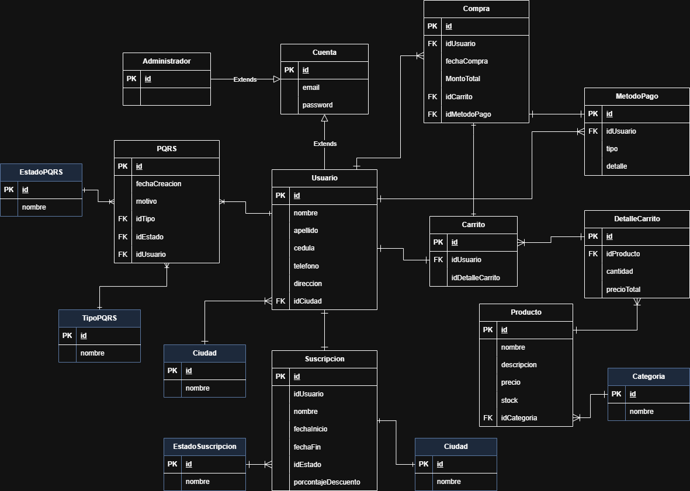

# CompraClick - Sistema de E-commerce

## Descripción
Sistema de comercio electrónico desarrollado con Spring Boot que permite la gestión de usuarios, productos, categorías y pedidos.

## Tecnologías Utilizadas
- Java 17
- Spring Boot 3.1.2
- Spring Security
- JWT (JSON Web Tokens)
- JPA/Hibernate
- MySQL/PostgreSQL
- Gradle

## Modelo de Negocio

### Actores del Sistema
- **Usuarios**: Clientes que realizan compras
- **Administradores**: Gestionan el sistema, productos y pedidos

### Funcionalidades Principales
- Registro y autenticación de usuarios
- Gestión de productos y categorías
- Carrito de compras
- Procesamiento de pedidos
- Panel de administración

## Requerimientos del sistema

### Requerimientos del usuario

1. **Registro de Usuario**
   - Los usuarios deben poder registrarse con una dirección de correo electrónico y una contraseña.
   - Los usuarios deben poder iniciar sesión con sus credenciales.
   - Los usuarios deben poder restablecer su contraseña en caso de olvido.
2. **Perfil de Usuario**
   - Los usuarios deben poder editar su información de perfil (nombre, dirección, métodos de pago, etc.).
   - Los usuarios deben poder ver su historial de compras.
3. **Navegación y Búsqueda**
   - Los usuarios deben poder navegar por categorías de productos.
   - Los usuarios deben poder buscar productos por nombre, categoría, o características.
4. **Carrito de Compras**
   - Los usuarios deben poder añadir productos a su carrito de compras.
   - Los usuarios deben poder ver y editar el contenido de su carrito de compras.
   - Los usuarios deben poder aplicar códigos de descuento en el carrito de compras.
5. **Proceso de Compra**
   - Los usuarios deben poder realizar el pago utilizando múltiples métodos de pago (tarjeta de crédito, PayPal, etc.).
   - Los usuarios deben recibir una confirmación de compra por correo electrónico.
6. **Suscripciones**
   - Los usuarios deben poder suscribirse para recibir descuentos semanales.
   - Los usuarios deben recibir notificaciones de nuevos descuentos por correo electrónico.
   - Los usuarios deben poder gestionar (activar, pausar o cancelar) su suscripción desde su perfil.
7. **Descuentos y Promociones**
   - El sistema debe aplicar automáticamente los descuentos semanales a los productos elegibles.
   - Los usuarios deben poder ver los productos en oferta y los descuentos aplicados.
8. Comentarios y Calificación
   - Los usuarios pueden realizar comentarios de los productos.
   - Los usuarios pueden calificar los productos.

### Requerimientos Administrativos

1. **Gestión de Productos**
   - Los administradores deben poder añadir, editar y eliminar productos.
   - Los administradores deben poder gestionar el inventario de productos.
2. **Gestión de Descuentos**
   - Los administradores deben poder crear y gestionar promociones y descuentos semanales.
   - Los administradores deben poder enviar notificaciones de descuentos a los suscriptores.
3. **Gestión de Usuarios**
   - Los administradores deben poder ver y gestionar cuentas de usuario.
   - Los administradores deben poder ver el historial de compras y suscripciones de los usuarios.
4. **Reportes y Análisis**
   - El sistema debe generar reportes de ventas, productos más vendidos y usuarios activos.
   - El sistema debe permitir la exportación de datos para análisis externo.

### Requerimientos de seguridad

1. **Autenticación y Autorización**
   - El sistema debe utilizar autenticación segura para el acceso de usuarios y administradores.
   - El sistema debe diferenciar los permisos entre usuarios regulares y administradores.
2. **Protección de Datos**
   - El sistema debe cifrar datos sensibles como contraseñas y detalles de pago.
3. **Integridad y Disponibilidad**
   - El sistema debe realizar copias de seguridad regulares de los datos.
   - El sistema debe tener medidas para garantizar la disponibilidad y recuperación ante desastres.

## Diagrama Entidad-Relación (ER)

### Configuración

1. Clona el repositorio:
   https://github.com/johanSt01/E-commerce.git
